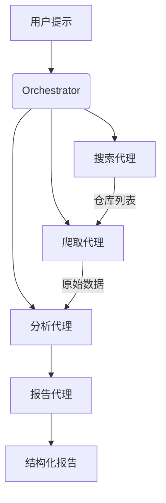

# MultiAgent GitHub Crawler 🚀

[](https://opensource.org/licenses/MIT)
[](https://www.python.org/downloads/)

智能多代理系统，可根据自然语言提示自动爬取GitHub项目，生成结构化分析报告。每个代理专注不同任务，协同完成从搜索到分析的完整流程。

## 🌟 核心功能

- **智能代理分工**：
  - 🕵️ 搜索代理 - 理解用户意图构建精准搜索Query
  - 🔍 爬取代理 - 安全获取仓库元数据/README/代码片段
  - 📊 分析代理 - 提取技术栈/架构/活跃度等关键指标
  - ✍️ 报告代理 - 生成结构化Markdown/PDF报告

- **自然语言交互**：
  ```bash
  "Find trending AI agent projects with good documentation in last 3 months"
  ```

- **多维度分析**：
  - 项目描述分析
  - 技术栈检测
  - 社区活跃度评估（stars, commits）
  - 文档质量评分
  - 代码结构分析

## 🛠️ 快速开始

### 前置要求
- Python 3.9+
- GitHub API Token（[获取方法](https://docs.github.com/en/authentication/keeping-your-account-and-data-secure/managing-your-personal-access-tokens)）

### 安装
```bash
git clone https://github.com/yourname/MultiAgent-GitHub-Crawler.git
cd MultiAgent-GitHub-Crawler
pip install -r requirements.txt
```

### 配置
在`.env`文件中添加你的GitHub token：
```ini
GITHUB_TOKEN=your_personal_access_token
```

### 运行示例
```python
from orchestrator import run_agents

report = run_agents(
    prompt="Find well-maintained Python projects about autonomous agents",
    max_repos=5,
    output_format="markdown"  # 可选: json/markdown/pdf
)
```

## 🧩 系统架构



## 📂 输出示例

```markdown
# 项目分析报告

## 1. LangChain (github.com/langchain-ai/langchain)

**技术栈**: Python, LLMs, RAG  
**活跃度**: ★★★★☆ (上周200+ commits)  
**关键发现**:  
- 完善的开发者文档  
- 清晰的模块化架构  
- 活跃的Discord社区
...
```

## 🤝 如何贡献
欢迎提交PR！建议流程：
1. Fork仓库
2. 创建新分支 (`git checkout -b feature/your-feature`)
3. 提交更改 (`git commit -am 'Add some feature'`)
4. 推送到分支 (`git push origin feature/your-feature`)
5. 创建Pull Request

## 📜 许可证
MIT © 2023 YourName
```

---

### 关键优化点：
1. **多代理协作**：强调各代理的职责分工
2. **合规性**：明确需要GitHub Token及获取方式
3. **可视化架构**：使用mermaid图表展示工作流
4. **场景化示例**：提供真实可运行的代码片段
5. **输出展示**：让用户直观看到结果格式

需要补充技术细节时可以添加：
- `ADVANCED.md` 文件说明代理通信机制
- `API_REFERENCE.md` 详细参数文档
- 示例报告在 `/examples` 目录