# <svg xmlns="http://www.w3.org/2000/svg" viewBox="0 0 16 16" width="30" height="30" style="vertical-align: -7px;"><path d="M7.693 1.066a.747.747 0 0 1 .614 0l7.25 3.25a.75.75 0 0 1 0 1.368L13 6.831v2.794c0 1.024-.81 1.749-1.66 2.173-.893.447-2.075.702-3.34.702-.278 0-.55-.012-.816-.036a.75.75 0 0 1 .133-1.494c.22.02.45.03.683.03 1.082 0 2.025-.221 2.67-.543.69-.345.83-.682.83-.832V7.503L8.307 8.934a.747.747 0 0 1-.614 0L4 7.28v1.663c.296.105.575.275.812.512.438.438.688 1.059.688 1.796v3a.75.75 0 0 1-.75.75h-3a.75.75 0 0 1-.75-.75v-3c0-.737.25-1.358.688-1.796.237-.237.516-.407.812-.512V6.606L.443 5.684a.75.75 0 0 1 0-1.368ZM2.583 5 8 7.428 13.416 5 8 2.572ZM2.5 11.25v2.25H4v-2.25c0-.388-.125-.611-.25-.735a.697.697 0 0 0-.5-.203.707.707 0 0 0-.5.203c-.125.124-.25.347-.25.735Z"></path></svg> GitSage 

[](https://opensource.org/licenses/MIT)
[](https://www.python.org/downloads/)

智能多代理系统，可根据自然语言提示自动爬取GitHub项目，生成结构化分析报告。每个代理专注不同任务，协同完成从搜索到分析的完整流程。

## 🌟 核心功能

- **智能代理分工**：
  - 🕵️ 搜索代理 - 理解用户意图构建精准搜索Query
  - 🔍 爬取代理 - 安全获取仓库元数据/README/代码片段
  - 📊 分析代理 - 提取技术栈/架构/活跃度等关键指标
  - ✍️ 报告代理 - 生成结构化Markdown/PDF报告

- **自然语言交互**：
  ```bash
  "Find trending AI agent projects with good documentation in last 3 months"
  ```

- **多维度分析**：
  - 项目描述分析
  - 技术栈检测
  - 社区活跃度评估（stars, commits）
  - 文档质量评分
  - 代码结构分析

## 🛠️ 快速开始

### 前置要求
- Python 3.9+
- GitHub API Token（[获取方法](https://docs.github.com/en/authentication/keeping-your-account-and-data-secure/managing-your-personal-access-tokens)）

### 安装
```bash
git clone https://github.com/Rick7117/CodePulse-Agents.git
cd CodePulse-Agents
pip install -r requirements.txt
```

### 配置
在`.env`文件中添加你的GitHub token：
```ini
GITHUB_TOKEN=your_personal_access_token
```

### 运行示例
```python
from orchestrator import run_agents

report = run_agents(
    prompt="Find well-maintained Python projects about autonomous agents",
    max_repos=5,
    output_format="markdown"  # 可选: json/markdown/pdf
)
```

## 🧩 系统架构

```mermaid
graph TD
    A[用户提示] --> B(Orchestrator)
    B --> C[搜索代理]
    B --> D[爬取代理]
    B --> E[分析代理]
    C -->|仓库列表| D
    D -->|原始数据| E
    E --> F[报告代理]
    F --> G[结构化报告]
```



## 📂 输出示例

```markdown
# 项目分析报告

## 1. LangChain (github.com/langchain-ai/langchain)

**技术栈**: Python, LLMs, RAG  
**活跃度**: ★★★★☆ (上周200+ commits)  
**关键发现**:  
- 完善的开发者文档  
- 清晰的模块化架构  
- 活跃的Discord社区
...
```

## 🤝 如何贡献
欢迎提交PR！建议流程：
1. Fork仓库
2. 创建新分支 (`git checkout -b feature/your-feature`)
3. 提交更改 (`git commit -am 'Add some feature'`)
4. 推送到分支 (`git push origin feature/your-feature`)
5. 创建Pull Request

## 📜 许可证
MIT © 2023 Rick7117

## Star History

[](https://www.star-history.com/#CodePulse-Agents/CodePulse-Agents&Date)
